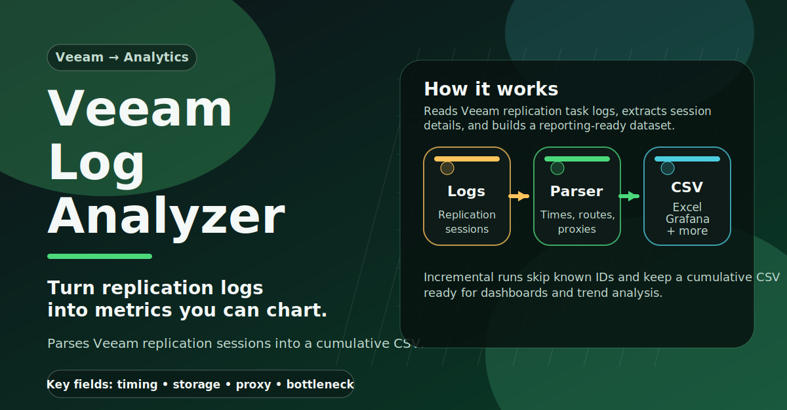

# Veeam Replication Log Analyzer



A PowerShell script that incrementally parses **Veeam Backup & Replication** task log files
and builds a cumulative CSV database of replication session metrics. The database can be
analyzed in Microsoft Excel, Access, Grafana, Power BI, or any other tool that can consume
a delimited text file.

## Purpose

Veeam writes detailed per-session log files but does not expose raw timing and routing data
through its console. This script fills that gap by extracting, per replication session:

- **When** data transfer started and ended, and when snapshot removal ran
- **How long** each phase took (replication duration, wait for semaphore, snapshot removal)
- **Where** data travelled: source/target ESXi hosts, source/target datastores/storage pools
- **Which proxies** handled the transfer
- **What the bottleneck** was (according to Veeam's own classification)

With this data you can answer questions such as:

- Which VMs consistently take the longest to replicate?
- Is a particular storage cluster or datastore a bottleneck?
- Are proxy resources being used efficiently?
- Have replication times changed after infrastructure changes?
- Which replication targets are slowest to receive data?

---

## System Requirements

| Requirement | Details |
|---|---|
| **Operating system** | Windows Server 2016 / 2019 / 2022 or Windows 10/11 |
| **PowerShell** | 5.1 or later (PowerShell 7 is supported) |
| **Veeam B&R** | The script must run on the Veeam server (or a host with access to the Veeam log directory) |
| **Veeam log path** | Default: `C:\ProgramData\Veeam\Backup` – task log files matching `Task.*.log` |
| **Output CSV path** | Any UNC or local path writable by the account running the script |
| **Execution policy** | `RemoteSigned` or `Unrestricted` must be set for the script to run |

To set the execution policy for the current user only:

```powershell
Set-ExecutionPolicy -Scope CurrentUser -ExecutionPolicy RemoteSigned
```

---

## Files

```
veeam-log-analyzer/
├── veeam-log-analyzer.ps1   # Main script
├── config.psd1              # Configuration (paths only – edit this)
├── Log/
│   └── ParsingLog.csv       # Auto-created: one row per script run (statistics)
└── Error.txt                # Auto-created: raw block dumps for sessions that failed to parse
```

---

## Installation

1. Copy `veeam-log-analyzer.ps1` and `config.psd1` to any directory on the Veeam server,
   for example `C:\Scripts\veeam-log-analyzer\`.
2. Edit `config.psd1` – at minimum set `OutputCsvPath` and `VeeamLogPath` (see below).
3. Run the script once manually to verify it works and to create the initial CSV:

   ```powershell
   & "C:\Scripts\veeam-log-analyzer\veeam-log-analyzer.ps1"
   ```

4. Schedule it via the Windows Task Scheduler (see [Scheduling](#scheduling)).

---

## Configuration

Open `config.psd1` in any text editor. All four keys are described inline:

```powershell
@{
    # Path to the output CSV database (must be writable by the scheduled task account)
    OutputCsvPath = "\\fileserver\share\Logs\VeeamReplicationLog.csv"

    # Root of the Veeam task log tree (default installation path shown)
    VeeamLogPath  = "C:\ProgramData\Veeam\Backup"

    # Directory for the script's own run log (ParsingLog.csv).
    # Leave empty ("") to use a Log\ subfolder next to the script.
    ScriptLogDir  = ""

    # File path for diagnostic error output.
    # Leave empty ("") to place Error.txt next to the script.
    ErrorLogPath  = ""
}
```

**Important:** the account that runs the scheduled task must have:
- Read access to `VeeamLogPath`
- Read/write access to the directory containing `OutputCsvPath`

---

## Scheduling

The typical deployment is a once-daily run, scheduled to start a few minutes after the last
nightly replication job is expected to finish.

### Windows Task Scheduler (recommended)

1. Open **Task Scheduler** → *Create Task*.
2. **General** tab: give it a name, choose *Run whether user is logged on or not*, tick
   *Run with highest privileges* if needed.
3. **Triggers** tab: *New* → *Daily*, set the time (e.g. 07:00 for an overnight window).
4. **Actions** tab: *New* → *Start a program*
   - Program: `pwsh.exe`  (or `powershell.exe` for Windows PowerShell 5.1)
   - Arguments:
     ```
     -NonInteractive -ExecutionPolicy RemoteSigned -File "C:\Scripts\veeam-log-analyzer\veeam-log-analyzer.ps1"
     ```
5. **Conditions / Settings** tabs: adjust to your environment.

### Command-line (schtasks)

```powershell
schtasks /Create /TN "Veeam Log Analyzer" /SC DAILY /ST 07:00 /RU "DOMAIN\serviceaccount" /RP /TR "pwsh.exe -NonInteractive -ExecutionPolicy RemoteSigned -File C:\Scripts\veeam-log-analyzer\veeam-log-analyzer.ps1"
```

### Frequency guidance

| Replication schedule | Recommended run frequency |
|---|---|
| Once per day (nightly) | Once per day, ~30 min after the last job |
| Multiple windows per day | Match to the end of each window, or run hourly |
| Continuous / frequent | Run every 15–60 minutes; the script is incremental and skips known IDs |

The script is safe to run more often than needed – it will simply add 0 new records if no new
log data is available.

---

## Output CSV – Column Reference

The output file uses a **semicolon (`;`)** delimiter and **UTF-8** encoding.
Open with *Data → From Text/CSV* in Excel and select `;` as the delimiter.

| Column | Type | Description |
|---|---|---|
| `ID` | GUID | Unique Veeam task session identifier. Used to prevent duplicate rows. |
| `Server` | string | VM name (replica source) |
| `StorageOfSource` | string | Datastore or storage pool name on the source side |
| `StorageOfTarget` | string | Datastore or storage pool name on the target side |
| `Bottleneck` | string | Veeam's bottleneck classification (`S` = Source, `T` = Target, `N` = Network, `P` = Proxy) |
| `HostOfSource` | string | FQDN of the ESXi host running the source VM |
| `HostOfTarget` | string | FQDN of the ESXi host that holds the replica |
| `Proxy` | string | Newline-separated list of `Source=<name>` / `Target=<name>` proxy pairs used |
| `StartReplication` | datetime | Timestamp when the data-transfer phase began |
| `EndReplication` | datetime | Timestamp when the data-transfer phase ended |
| `StartSnapshotRemoval` | datetime | Timestamp when snapshot removal started |
| `EndSnapshotRemoval` | datetime | Timestamp when snapshot removal ended |
| `DurationReplication` | integer | Data-transfer duration in **whole minutes** |
| `WaitForSemaphore` | integer | Gap between end of transfer and start of snapshot removal, in whole minutes (high values may indicate resource contention) |
| `DurationSnapshotRemoval` | integer | Snapshot removal duration in **whole minutes** |

### Internal run log (`Log\ParsingLog.csv`)

Written once per script execution. Useful for monitoring script health.

| Column | Description |
|---|---|
| `Date start` | When this script run began |
| `Date end` | When it ended |
| `Time read CSV` | How long it took to load existing IDs from the output CSV |
| `New records` | Sessions added to the CSV in this run |
| `Existed records` | Sessions skipped because their ID was already present |
| `Incomplete records` | Sessions that started but lacked enough log data to export |
| `Atypical records` | Sessions where str1+str4 were found but str2 or str3 were missing |
| `Insufficient records` | Sessions missing one or more of the 9 expected marker strings |
| `Time script` | Total wall-clock time for the run |

---

## Connecting the CSV as a Data Source

### Microsoft Excel

1. Open Excel → **Data** → **Get Data** → **From Text/CSV**.
2. Browse to `VeeamReplicationLog.csv`.
3. In the import wizard set **Delimiter** to *Semicolon*, **File Origin** to *65001 UTF-8*.
4. Click **Load** or **Transform Data** to build a Power Query before loading.
5. Refresh the data on demand with **Data → Refresh All**, or automate via a macro/Power
   Automate flow.

Useful pivot table dimensions: `Server`, `StorageOfSource`, `StorageOfTarget`, `HostOfSource`,
`HostOfTarget`, `Bottleneck`. Measure: `DurationReplication` (sum or average).

### Microsoft Access

1. Create a new (or open an existing) `.accdb` database.
2. **External Data** → **New Data Source** → **From File** → **Text File**.
3. Select the CSV file, choose **Link to the data source** (for live updates).
4. Set delimiter to `;`, first row contains field names, text qualifier `"`.
5. Query the linked table with standard SQL. Example:

   ```sql
   SELECT Server, StorageOfSource, StorageOfTarget, AVG(DurationReplication) AS AvgMin
   FROM VeeamReplicationLog
   GROUP BY Server, StorageOfSource, StorageOfTarget
   ORDER BY AvgMin DESC;
   ```

### Grafana (with CSV / Infinity plugin)

Grafana does not natively read local CSV files, but several approaches work:

**Option A – Grafana Infinity plugin (CSV over HTTP/UNC):**

1. Install the *Marcusolini Infinity* data source plugin (or the official *Infinity* plugin).
2. Add a new *Infinity* data source, set type to **CSV**.
3. Set URL to a web-accessible path or a local file path (file:// – supported on some
   platforms).
4. Build panels using the CSV columns as fields.

**Option B – Import into a database, then use native Grafana source:**

1. Import the CSV into PostgreSQL, MySQL, or InfluxDB (InfluxDB: store durations as fields,
   server/host/storage as tags).
2. Point Grafana at that database using its native data source plugin.
3. Typical dashboard panels:
   - Time series: `DurationReplication` grouped by `Server` over time
   - Bar chart: average replication time by `StorageOfTarget`
   - Heat map: replication start time vs. duration (spot scheduling conflicts)
   - Table: slowest sessions in the last 7 days

**Option C – Use Grafana's built-in SQLite data source:**

Convert the CSV to a SQLite database once (e.g. with Python or the `sqlite3` CLI), then use
the *frser-sqlite-datasource* community plugin.

### Power BI

1. **Home** → **Get Data** → **Text/CSV**.
2. Select the file, click **Transform Data**.
3. In Power Query Editor:
   - Set delimiter to `;`.
   - Set the type of `StartReplication`, `EndReplication`, `StartSnapshotRemoval`,
     `EndSnapshotRemoval` to **Date/Time**.
   - Set `DurationReplication`, `WaitForSemaphore`, `DurationSnapshotRemoval` to **Whole
     Number**.
4. Click **Close & Apply**.
5. Build reports. Suggested visuals:
   - Clustered bar chart: average `DurationReplication` by `Server`
   - Matrix: `HostOfSource` × `StorageOfTarget` with `DurationReplication` as values
   - Slicer on `Bottleneck` to filter by bottleneck type
   - Line chart: daily average replication time trend

For automated refresh, publish the report to Power BI Service and configure a **Gateway**
pointing to the CSV file location.

---

## Troubleshooting

| Symptom | Likely cause | Resolution |
|---|---|---|
| `Error.txt` keeps growing | Some log files don't match the expected pattern | Inspect the entries; may be non-replication jobs (backup, SureBackup) sharing the log directory |
| `Incomplete records` count is high | Veeam jobs were cancelled or failed mid-run | Normal for interrupted jobs; no action needed |
| No new records after a run | Log files were not modified since the last run | Check that Veeam ran replication and that `VeeamLogPath` points to the right directory |
| `Import-PowerShellDataFile` error | `config.psd1` not found next to the script | Ensure both files are in the same directory |
| CSV grows very large over months | Expected – append-only design | Archive old rows: copy the CSV, truncate it to the last N days, keep the archive |

---

## License

This project is licensed under the **GNU General Public License v3.0**.
See the [LICENSE](LICENSE) file for details.
